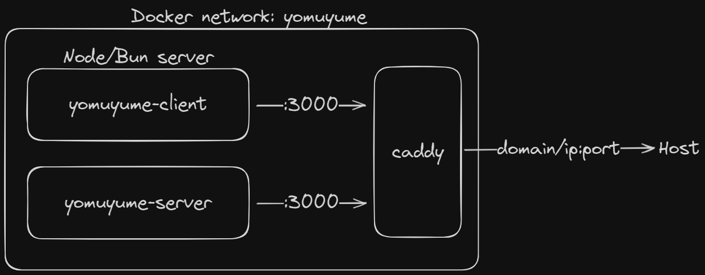

# Yomuyume deployment guide

# Table of contents

# Pre-requisites
- A domain, optional if you're not planning to use a reverse proxy.

- A server, preferably with a x86_64 CPU, an NVIDIA GPU with CUDA support for the recommendation system.

- `git clone https://github.com/Liminova/yomuyume-deploy.git && cd yomuyume-deploy`

- Create an empty database file: `touch sqlite.db`

- Install Docker Engine using [this guide](https://docs.docker.com/engine/install/), make sure to follow the post-installation steps. Skip if you already have Docker installed.

- Create a new docker network `docker network create yomuyume`

# Configuring the `docker-compose.yml`

## The server
- Change the library path to your own in `volumes`
    > How `ports` and `volumes` are defined: `<host>:<container>`
- Change `JWT_SECRET` and `SMTP` credentials in `environment`
    > Run `openssl rand -hex 32` to generate a random string

## The client & reverse proxy

### Option 1 - No reverse proxy
This expose the client and server directly to the host machine through port `3000` and `3001` respectively.

1. Inside `docker-compose.yml`, keep `yomuyume-server` and `yomuyume-client` (either `yomuyume-client-bun` or `yomuyume-client-node`, Bun is faster but doesn't support non-AVX CPUs). Comment out or remove the rest.

2. `docker compose up -d --build`

The `yomuyume-client` should be up and running on `http://<your-server-ip>:3000` and `yomuyume-server` on `http://<your-server-ip>:3001`.

### Option 2.1 - Caddy + static client
Reverse proxy the `yomuyume-server` and serve the `yomuyume-client` as static files. This allow both client and server to share the same port, or better, the same domain with HTTPS.

1. Inside `docker-compose.yml`
    - Keep `yomuyume-server`, `yomuyume-client-build` and `yomuyume-caddy`. Comment out or remove the rest.
    - Remove the `ports` for `yomuyume-server`

2. Prepare Caddy binary
    - Follow this [community guide](https://caddy.community/t/how-to-use-dns-provider-modules-in-caddy-2/8148) to download the Caddy binary with your DNS provider plugin, place it in the root directory of this repo
    - Rename the binary to `caddy`
    - Run `sudo chmod +x ./caddy`

3. Inside `./caddy/Caddyfile`
    - Replace `example.com` with your own domain
    - Replace `comic` with your preferred subdomain

4. Run `docker compose up -d --build`

The `client-server` should be up and running on your specified domain.

> If you don't *own* a domain   1. Create a free subdomain on DuckDNS   2. Replace `./caddy/Caddyfile` with `./caddy/no-domain.Caddyfile` of caddy inside `docker-compose.yml`

### Option 2.2 - Caddy + client with Node/Bun server
This doesn't make any sense, just use the above option.

### Option 3 - Cloudflare Tunnel + client with Node/Bun server
The first two options require your server is directly exposed to the internet. If you're hosting yomuyume from your home, it's likely that you're behind a Carrier-grade NAT. This is essentially a situation where you have a router behind another router, but the one facing the internet is managed by your carrier, preventing you from exposing ports to the internet. This might also be the case if, for any reason, you prefer not to expose your ports. Under these circumstances, your best choice would be to use Cloudflare Tunnel.

The Cloudflare daemon, which operates on the same Docker network as your server, securely manages traffic between your server and their global network before it reaches the internet.

1. Inside `docker-compose.yml`
    - Keep `yomuyume-server`, `yomuyume-client` (either `yomuyume-client-bun` or `yomuyume-client-node`, Bun is faster but doesn't support non-AVX CPUs), `cloudflared`. Comment out or remove the rest.

2. Go to [one.dash.cloudflare.com](https://one.dash.cloudflare.com/)
    - Do the basic steps to create a Team.
    - `Access` > `Tunnels` > create new tunnel > get the token at last step
    - Inside `docker-compose.yml`, replace the `<TOKEN>` environment variable of `cloudflared` with your own

3. Adding hostname to Cloudflare on Cloudflare One dashboard
    - `Access` > `Tunnels` > modify > `Public Hostnames` tab
    - Create a new hostname for `yomuyume-client`
        - Subdomain, domain: your own
        - Path: leave blank
        - Type: `HTTP`
        - URL: `yomuyume-client:3000`
    - Create 4 new hostnames for `yomuyume-server` (one for each path)
        - Subdomain, domain: your own
        - Path: `/api`, `/swagger`, `/api-docs`, `/redoc`
        - Type: `HTTP`
        - URL: `yomuyume-server:3000`

4. Run `docker compose up -d`

The `client-server` should be up and running on your specified domain.

# Upgrade (will be improved in the future)
- Stop all containers: `docker compose down`
- Clear docker build cache: `docker builder prune -a`
- Remove images without containers: `docker image prune -a`
- Start all containers: `docker compose up -d --build`